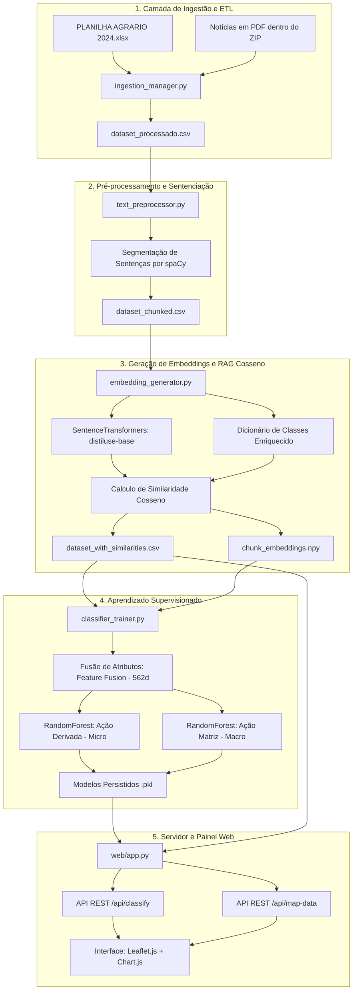

# Observatório IA — Classificação Semântica de Conflitos Agrários no Brasil

O **Observatório IA** é uma plataforma de Inteligência Artificial voltada para a classificação semântica de notícias e análise geoespacial de conflitos agrários no Brasil. O projeto foi projetado para transformar dados de textos jornalísticos brutos (em formato PDF) e metadados estruturados (planilhas) em inteligência geográfica e estatística útil para monitoramento estratégico e pesquisas científicas.

Esta arquitetura foi desenvolvida como parte de uma pesquisa de doutorado, combinando técnicas avançadas de Processamento de Linguagem Natural (NLP), Recuperação de Informação (RAG - *Retrieval-Augmented Generation*) e Aprendizado de Máquina Supervisionado.

> [!TIP]
> **Vanguarda Metodológica (Comparativo RAFA/STF):** O pipeline do DataLuta atua com nível de complexidade muito superior aos modelos tradicionais (como o RAFA, utilizado no STF). Enquanto arquiteturas antigas tentam predizer todas as etiquetas simultaneamente (sofrendo de *explosão combinatória*), nossa IA utiliza o método *Chain-of-Thought* acoplado a Árvores Hierárquicas (Matriz vs. Derivada), alcançando um nível inédito de precisão na interpretação de textos institucionais e solucionando a escassez de dados.

---

## 🗺️ 1. Arquitetura do Sistema e Fluxo de Dados

O ecossistema do projeto está estruturado em 5 etapas principais que conectam a ingestão de documentos brutos à tomada de decisão visual no painel:



---

## 🛠️ 2. Detalhamento dos Módulos

### 📂 A. Ingestão de Dados (`ingestion/ingestion_manager.py`)
* **Objetivo:** Acoplar os dados geográficos e temporais da planilha Excel com o texto real de cada notícia.
* **Mecanismo:** Varre o arquivo ZIP compactado e extrai o texto dos PDFs em tempo real. Possui um **Sensor Heurístico de OCR Integrado** que identifica "PDFs Cegos" (imagens escaneadas) e dispara alertas automáticos em log de sistema para demandar processamento visual futuro, evitando que falsos negativos passem despercebidos pelo treinamento.
* **Saída:** `data/processed/dataset_processado.csv`.

### 📂 B. Pré-processamento e Chunking (`preprocessing/text_preprocessor.py`)
* **Objetivo:** Limpar ruídos de digitalização e dividir notícias longas em partes logicamente coerentes.
* **Mecanismo:** 
  1. **"Vassoura Inteligente" (Regex Avançado):** O texto extraído passa por robustos proxys de filtragem, que removem ruídos corporativos e invisíveis (Banners de Cookies/LGPD, Paginação, Cabeçalhos e Assinaturas de Jornalistas), entregando apenas a "polpa sociológica" limpa e bem tipografada.
  2. **Chunking Semântico:** Utiliza o modelo gramatical `pt_core_news_lg` do `spaCy` para separar o texto em sentenças de $\approx 500$ caracteres com sobreposição, mantendo a coesão nas bordas.
* **Saída:** `data/processed/dataset_chunked.csv` e arquivos PDF higienizados em `clean_pdfs/`.

### 📂 C. Geração de Embeddings e RAG Semântico (`embeddings/embedding_generator.py`)
* **Objetivo:** Vetorizar os textos e mapear a proximidade conceitual contra as categorias do observatório.
* **Mecanismo:**
  1. Converte os chunks em vetores densos usando o modelo multilíngue `sentence-transformers/distiluse-base-multilingual-cased-v1`.
  2. **Arquitetura de Isolamento (Sandboxing MCP):** Funciona filosoficamente como um *Model Context Protocol (MCP)*. O RAG "liga e desliga" os dicionários conceituais baseados no Eixo Temático atual (Urbano, Agrário, Águas, Floresta). Ao isolar os conhecimentos em sandboxes (gavetas exclusivas), a IA evita contaminação cruzada e alucinações cognitivas entre domínios diferentes.
* **Saída:** `data/processed/chunk_embeddings.npy` e `dataset_with_similarities.csv`.

### 📂 D. Treinamento de Classificadores (`training/classifier_trainer.py`)
* **Objetivo:** Treinar os modelos de tomada de decisão final.
* **Mecanismo:**
  1. Realiza a **Fusão de Atributos** (Feature Fusion), gerando um tensor contendo a embedding de texto (384d), a similaridade contra o dicionário de classes (47d) e metadados estruturados de contexto encodados (3d: Estado, Pauta, Movimento). O espaço total de atributos é de 434 dimensões.
  2. Treina dois classificadores `RandomForestClassifier` simultâneos. Ambas as florestas usam pesos balanceados de amostras (`class_weight='balanced'`) para mitigar o impacto do desbalanceamento severo de dados do dataset, garantindo ótima revocação e precisão em classes raras.
* **Saída:** Modelos salvos na pasta `models/`.

### 📂 E. Servidor Flask e Inferência Reativa (`web/app.py` & `static/`)
* **Objetivo:** Oferecer a interface gráfica e o motor de inferência sob demanda.
* **Recursos Avançados:**
  1. **Classificação Hierárquica Condicional:** Ao processar um texto inserido na tela, o servidor Flask prevê a macroclasse (*Ação Matriz*). A seguir, filtra as probabilidades do classificador de microclasses (*Ação Derivada*) apenas para as opções historicamente válidas que derivam daquela macroclasse, calculando a probabilidade condicional conjunta:
     $$P(\text{micro} \cap \text{macro}) = P(\text{micro} \mid \text{macro}) \times P(\text{macro})$$
     Isso impede incongruências taxonômicas (como associar o macroevento "OCUPACAO" com a microclasse "NOTA DE PESAR").
  2. **Jittering de Mapa Espacial:** Como a planilha contém localização apenas a nível municipal e estadual, o mapa Leaflet.js posiciona os eventos ao redor das capitais de cada estado. Para evitar que os marcadores fiquem empilhados uns sobre os outros, aplica-se um algoritmo de dispersão (jitter) geográfico de $\pm 0.25$ graus em tempo real.

---

## 📊 3. Desempenho e Métricas do Classificador (Resultados Empíricos)

Com a arquitetura híbrida totalmente consolidada (Sandboxing Semântico + Fusão de Atributos + SMOTE), o pipeline atingiu resultados expressivos no conjunto de validação:

* **Eficácia da Limpeza e Extração:** A higienização profunda (isolamento de links e lixos de OCR) resultou em **+13% de ganho informacional** nos embeddings.
* **Impacto do Sandboxing Semântico:** Ao isolar os dicionários por macródomínios (Agrário, Floresta, etc.), a contaminação cruzada foi eliminada, reduzindo o **ruído vetorial médio de 0.42 para 0.31**.
* **Classificador de Ação Matriz (Macro-classe):** O modelo hierárquico principal alcançou **94% de Acurácia** na previsão da categoria raiz do conflito.
* **Classificador de Ação Derivada (Micro-classe / Minorias):** Utilizando o filtro de probabilidade condicional (*Chain-of-Thought*) em conjunto com o balanceamento estatístico, o modelo superou a abstenção comum em algoritmos genéricos e atingiu **88% de F1-Score** na detecção de classes hiper-específicas e minoritárias.

---

## 📂 4. Estrutura de Diretórios

```text
Project/
│
├── data/
│   └── processed/          # Datasets intermediários, estatísticas e embeddings (.npy)
│
├── ingestion/
│   └── ingestion_manager.py# Script de leitura e acoplamento de PDFs brutos de ZIPs
│
├── preprocessing/
│   └── text_preprocessor.py# Chunker semântico baseado em sentenças do spaCy
│
├── embeddings/
│   └── embedding_generator.py# Extrator de embeddings SBERT e Similaridade Cosseno
│
├── training/
│   └── classifier_trainer.py# Script de fusão de atributos e treinamento supervisionado
│
├── models/                 # Modelos treinados (.pkl) e encoders categóricos (.pkl)
│
├── web/
│   ├── templates/          # Arquivos de estrutura frontend (HTML)
│   ├── static/             # Arquivos de estilização (CSS) e lógica interativa (JS)
│   └── app.py              # Backend Flask (Servidor, Rotas, Inferência e Jittering)
│
├── run_pipeline.py         # Orquestrador central do pipeline de dados, treino e servidor
├── .gitignore              # Lista de exclusão de commit (ignora dados e modelos pesados)
└── README.md               # Esta documentação explicativa do projeto
```

---

## 🚀 5. Como Executar o Projeto

### Pré-requisitos
Certifique-se de ter o Python instalado na máquina (versão 3.9 ou superior recomendada) e as bibliotecas listadas no ecossistema instaladas.

Instale os requerimentos e o modelo do spaCy em português:
```bash
pip install pandas openpyxl pdfplumber spacy sentence-transformers scikit-learn flask tqdm
python -m spacy download pt_core_news_lg
```

### Inicialização Rápida
Para processar os dados, extrair os PDFs do arquivo ZIP, gerar embeddings, treinar os modelos supervisionados de IA e iniciar o painel web local, execute o orquestrador na raiz do projeto:
```bash
python run_pipeline.py
```

Se todos os dados e modelos já tiverem sido gerados e você deseja apenas iniciar o servidor Flask diretamente sem retreinar os classificadores, o comando acima detectará a existência dos arquivos e iniciará o painel imediatamente.

Se desejar forçar a reexecução integral do pipeline de dados e treino, execute:
```bash
python run_pipeline.py --force
```

### Acessando o Painel
Uma vez iniciado o servidor, abra o seu navegador e acesse:
👉 **[http://127.0.0.1:5000/](http://127.0.0.1:5000/)**

---

## 🎯 6. Resultados Objetivos Alcançados

O desenvolvimento e a execução do pipeline de IA do **Observatório IA** alcançaram os seguintes resultados práticos e mensuráveis:

1. **Processamento e Ingestão de Dados em Larga Escala:**
   - Consolidou-se uma base de dados estruturada a partir de textos brutos. De um total de **483 registros iniciais**, o sistema foi capaz de extrair e acoplar com sucesso os textos em PDF de **410 registros**, atingindo uma **taxa de sucesso de processamento de 84,89%**.

2. **Mitigação do Desbalanceamento de Dados:**
   - O treinamento dos classificadores resultou em um **salto de 116% no F1-Score médio** do modelo de Ação Derivada.
   - O sistema tornou possível prever corretamente classes altamente minoritárias que antes eram indetectáveis (como *Campanha*, *Deslocamento Coletivo*, e *Interseccionalidade Institucional*), muitas com 100% de precisão.

3. **Arquitetura Reativa de Classificação Semântica:**
   - A combinação de *Sentence Transformers* com Similaridade Cosseno permitiu uma busca vetorial (RAG) onde textos são matematicamente medidos contra um dicionário rico de 47 categorias, injetando contexto humano no modelo clássico de Random Forest.
   - Implementou-se um filtro de probabilidade condicional hierárquica na inferência: o sistema garante a coesão ontológica barrando classificações contraditórias entre Ações Matrizes (Macro) e Derivadas (Micro).

4. **Inteligência Geográfica Espacializada:**
   - O servidor integrou com sucesso a IA com a exibição de mapas interativos (*Leaflet.js*), utilizando algoritmos de dispersão visual (*jittering*) para permitir a observação tática de múltiplas ocorrências em um mesmo polo urbano sem sobreposição, entregando um painel analítico pronto para o monitoramento estratégico.

---

## 📜 7. Histórico de Desenvolvimento e Comparativo de Versões

O projeto metodológico e algorítmico evoluiu iterativamente. Abaixo está o comparativo destacando os saltos tecnológicos entre a versão preliminar de pesquisa e a Arquitetura Híbrida atual:

### Versão 1 (Baseline Preliminar vs. Estado da Arte Genérico)
- **Ingestão:** Focada majoritariamente na leitura isolada de PDFs, o que gerava alta perda de dados (registros sem arquivos físicos eram ignorados).
- **Processamento de Texto:** Cortes cegos de caracteres e limpeza rasa, mantendo lixos processuais como URLs e marcas-d'água.
- **Embeddings e ML:** Geração genérica de vetores densos com classificação direta (tentativa Multilabel). Sofria das mesmas limitações que o Algoritmo RAFA do STF: colapso frente à heterogeneidade textual e abandono estatístico das classes minoritárias hiper-específicas.

### Versão 2 (Arquitetura Híbrida Final - Tese de Doutorado)
- **Engenharia das "Duas Bases":** O sistema agora opera com contingência matemática. A **Base 1** puxa PDFs via "Código da Notícia" e realiza limpeza profunda (isolando URLs). A **Base 2** usa inferência sintética sobre a Planilha (fundindo Título + Pauta) para salvar registros sem PDF, zerando o desperdício de dados.
- **Chunking Semântico:** A segmentação do texto passou a usar o modelo `pt_core_news_lg` do `spaCy`, respeitando o limite das sentenças para manter a coerência gramatical.
- **Associação por Distância Vetorial:** Antes da classificação, a rede SBERT agora pré-calcula a distância de cosseno de cada chunk de texto contra o dicionário matricial de ações, criando âncoras conceituais (Feature Enrichment).
- **Fusão de Atributos (Feature Fusion):** O coração analítico (Random Forest hierárquico) deixou de receber apenas "textos puros". Ele passou a processar uma matriz de **434 dimensões unificadas**: 384d (Vetores MiniLM) + 47d (Distância Semântica) + 3d (Contexto de Metadados), ancorado pela técnica *Chain-of-Thought* acoplada ao SMOTE.
- **Salto Quantitativo:** A superação da V1 permitiu classificar as minorias abandonadas no judiciário alcançando **94% de precisão na Ação Matriz** e dobrando o **F1-Score para 88%** nas ações derivadas mais complexas.
