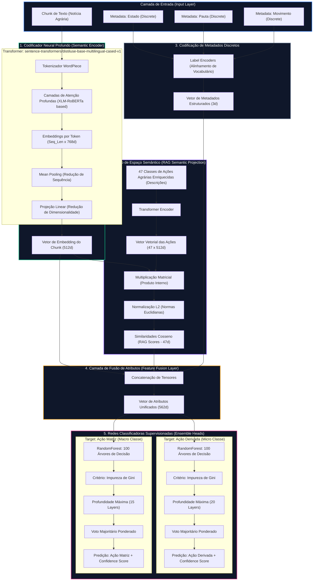

# Arquitetura Deep Learning & Machine Learning — Observatório IA

Este documento descreve detalhadamente a arquitetura de Inteligência Artificial e a modelagem matemática integrada desenvolvida para o **Observatório IA** de classificação de conflitos agrários.

---

## 🧠 Grafo da Arquitetura da Inteligência Artificial

A arquitetura da IA é de caráter híbrido, combinando **Transformers Multilíngues (Deep Learning)** para representação semântica, **RAG Semântico (Álgebra Linear)** para ancoragem vetorial e **Ensemble Trees (Machine Learning Supervisionado)** para a tomada de decisão final:

---

## 📐 Formulação Matemática dos Processos de IA

### 1. Codificação de Sentenças e Pooling
Dado um fragmento de texto $T$ (chunk semântico), ele é tokenizado em subpalavras $t_1, t_2, \dots, t_N$. O codificador profundo (Transformer) gera uma representação vetorial oculta para cada token em cada camada:
$$\mathbf{H} = \text{Transformer}(t_1, t_2, \dots, t_N) \quad \mathbf{H} \in \mathbb{R}^{N \times 768}$$

Para agregar essa sequência de vetores em uma única representação de documento, o pooling de média (**Mean Pooling**) é realizado em toda a extensão da sequência, seguido por uma projeção linear de redução para 512 dimensões:
$$\vec{e}_{pool} = \frac{1}{N} \sum_{i=1}^{N} \vec{h}_i$$
$$\vec{e}_{chunk} = \mathbf{W}_{proj} \vec{e}_{pool} + \vec{b} \quad \vec{e}_{chunk} \in \mathbb{R}^{512}$$

### 2. Projeção Semântica por Similaridade (RAG Cosseno)
Para superar o limite de generalização de pequenos datasets, ancoramos o vetor do texto no **Espaço das Ações Agrárias**. Temos $K = 47$ descrições semânticas detalhadas de ações, codificadas no mesmo espaço vetorial:
$$\vec{a}_j = \text{Encoder}(\text{Descrição da Ação } j) \quad \vec{a}_j \in \mathbb{R}^{512}, \quad j = 1, \dots, 47$$

Projetamos o vetor do chunk $\vec{e}_{chunk}$ sobre cada vetor de ação $\vec{a}_j$ utilizando o cálculo de **Similaridade Cosseno**:
$$S_j = \text{SimCosseno}(\vec{e}_{chunk}, \vec{a}_j) = \frac{\vec{e}_{chunk} \cdot \vec{a}_j}{\|\vec{e}_{chunk}\|_2 \|\vec{a}_j\|_2} \quad S_j \in [-1, 1]$$

Isso gera o vetor de scores RAG $\vec{s} \in \mathbb{R}^{47}$:
$$\vec{s} = [S_1, S_2, \dots, S_{47}]^T$$

### 3. Fusão Multimodal de Atributos
Os metadados discretos de contexto são processados por encoders de dicionário para obter uma representação de números inteiros:
$$\vec{m} = [Encode(Estado), Encode(Pauta), Encode(Movimento)]^T \quad \vec{m} \in \mathbb{R}^3$$

A camada de **Fusão** concatena todas as representações em um único tensor híbrido contendo a semântica densa, as âncoras RAG e as restrições categóricas:
$$\vec{x}_{fused} = [\vec{e}_{chunk} \;\|\; \vec{s} \;\|\; \vec{m}] \quad \vec{x}_{fused} \in \mathbb{R}^{562}$$

### 4. Tomada de Decisão por Ensemble (Random Forest Heads)
O vetor de fusão $\vec{x}_{fused}$ alimenta duas florestas aleatórias independentes constituídas por $M = 100$ estimadores (árvores de decisão binárias).

Para cada árvore $T_m$ na floresta, o split de nós busca maximizar o ganho de informação reduzindo a **Impureza de Gini** $I_G$:
$$I_G(p) = 1 - \sum_{c=1}^{C} p_c^2$$
Onde $p_c$ é a probabilidade da classe $c$ no subconjunto de dados.

A predição de probabilidade final da classe (usada como score de confiança) é a média aritmética das probabilidades preditas pelas $M$ árvores individuais (Bagging):
$$P(y = c \mid \vec{x}_{fused}) = \frac{1}{M} \sum_{m=1}^{M} P_m(y = c \mid \vec{x}_{fused})$$
$$\hat{y} = \arg\max_{c} P(y = c \mid \vec{x}_{fused})$$
 Onde $\hat{y}$ é a classe predita final e $P(y = \hat{y} \mid \vec{x}_{fused})$ é o score de confiança exibido no dashboard.
