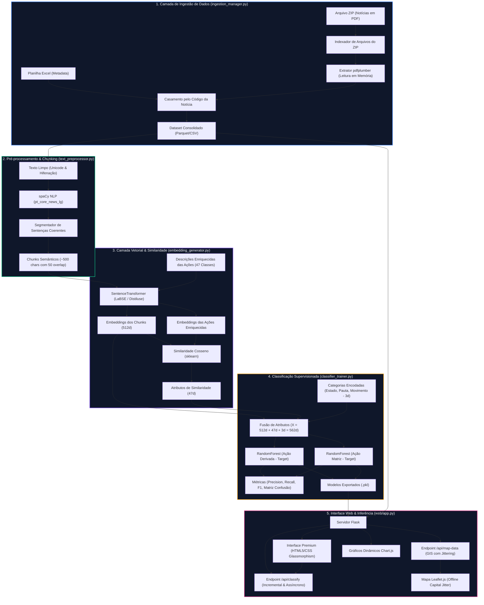

# Arquitetura Técnica do Processo — Observatório IA

Este documento descreve a arquitetura detalhada de processamento de dados, inteligência artificial e visualização implementada no **Observatório IA** para classificação semântica de notícias e análise espacial de conflitos agrários no Brasil.

---

## 🗺️ Fluxo de Dados Ponta a Ponta

O diagrama abaixo ilustra o fluxo de processamento de dados, desde a ingestão até a disponibilização no painel interativo e inferência em tempo real:

---

## 🔍 Detalhamento Técnico das Camadas

### 1. Camada de Ingestão e Processamento
Para viabilizar a análise sem carregar excessivamente o disco rígido, implementamos um sistema de extração de PDFs diretamente do arquivo compactado:
- **E/S Otimizada:** O `ZipFile` do Python localiza o arquivo do PDF no dicionário central do arquivo ZIP. A biblioteca `pdfplumber` lê o fluxo binário resultante (stream de bytes) e realiza a decodificação de caracteres unicode e remoção de marcas de hifenação do layout de jornal ou artigo.

### 2. Chunking Semântico Orientado a Sentenças
Diferente do chunking tradicional por caracteres (que corta palavras ao meio e destrói o fluxo sintático), a segmentação por frases mantém a coesão gramatical:
- **Modelo de Sentenciação:** Utilizamos o modelo do spaCy `pt_core_news_lg` que foi treinado no corpus da língua portuguesa. Ele detecta pontos finais de abreviações e os separa de reais fins de frases.
- **Algoritmo de Agrupamento:**
  - As frases são iteradas sequencialmente.
  - Elas são acumuladas até que a soma dos caracteres alcance $\approx 500$ caracteres.
  - Para evitar perda de contexto na borda, a última sentença do chunk atual é duplicada no início do próximo chunk (overlap de $\approx 50$ caracteres).

### 3. Vetorização Semântica e Cálculo de Proximidade (RAG Semântico)
Em vez de depender apenas de embeddings puras para classificação (que exigem muitos dados de treino), utilizamos as descrições semânticas das ações como âncoras conceituais:
- **Modelo de Embeddings:** `distiluse-base-multilingual-cased-v1` da biblioteca `sentence-transformers`. Ele gera vetores de 512 dimensões.
- **RAG Local / Cosseno:**
  $$Similaridade(\vec{u}, \vec{v}) = \frac{\vec{u} \cdot \vec{v}}{\|\vec{u}\| \|\vec{v}\|}$$
  Para cada chunk de texto da notícia, calculamos sua similaridade contra cada uma das 47 ações derivadas pré-cadastradas no dicionário. Isso gera um vetor de 47 dimensões de similaridades semânticas que atua como um forte sinal de classificação (Feature Enrichment).

### 4. Modelo de Fusão e Classificação Supervisionada
A grande inovação desta arquitetura é a **Fusão de Atributos** (Feature Fusion). O classificador RandomForest não olha apenas para o texto, mas sim para uma representação híbrida:

| Tipo de Atributo | Origem | Dimensões | Finalidade |
|---|---|---|---|
| **Embedding Densa** | Codificação SentenceTransformers | 512 | Captura nuances de sentimentos, jargões e contextos textuais. |
| **Similaridade Semântica** | Cosseno contra descrições das Ações | 47 | Fornece proximidade explícita com os alvos cadastrados (RAG). |
| **Metadados Estruturados** | Encoders (Estado, Pauta, Movimento) | 3 | Fornece contexto geográfico, histórico e sociopolítico do evento. |
| **Vetor de Entrada Final (X)** | Concatenação de todos os anteriores | **562** | Representação unificada para o classificador supervisionado. |

Treinamos dois modelos `RandomForestClassifier` em paralelo:
- **Classificador de Ação Derivada:** Classifica entre as 47 classes finais de alta granularidade.
- **Classificador de Ação Matriz:** Classifica entre as 11 macro classes organizacionais.

### 5. Arquitetura da Interface e Visualização GIS
A interface com o usuário foi projetada com foco em reatividade e alto nível de estética visual:
- **Jittering no Leaflet.js:** Como a planilha tem apenas o nome do `Estado` e do `Município` (sem coordenadas precisas de latitude e longitude), geocodificamos os conflitos usando as coordenadas da capital do estado. Para evitar que centenas de marcadores fiquem empilhados exatamente na mesma coordenada, aplicamos um algoritmo de **Jittering** (dispersão uniforme) em tempo real:
  $$Lat_{visual} = Lat_{capital} + \Delta, \quad \text{onde } \Delta \sim U(-0.25, 0.25)$$
  $$Lng_{visual} = Lng_{capital} + \Delta, \quad \text{onde } \Delta \sim U(-0.25, 0.25)$$
  Isso distribui as ocorrências em um raio circular visível ao redor da capital do estado correspondente, preservando a coerência geoespacial e permitindo a scannabilidade visual de hotspots regionais.
- **Chamadas Assíncronas (Inference API):** Ao colar um texto, o JavaScript envia a requisição para `/api/classify` de forma assíncrona. O Flask processa os chunks do texto sob demanda e retorna previsões detalhadas com scores de confiança. O front-end atualiza a tela instantaneamente com transições suaves e barras de progresso animadas.
