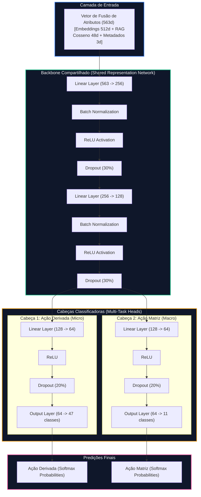

# Arquitetura da Rede Neural Multi-Tarefa — Observatório IA

Este documento detalha o projeto, a formulação matemática e o mapeamento estrutural da **Rede Neural Profunda Multi-Tarefa (Multi-Task Deep Neural Network - MT-DNN)** implementada em PyTorch para a classificação simultânea de macroclasses e microclasses de conflitos agrários.

---

## 1. Visão Geral da Arquitetura

A arquitetura adotada baseia-se no paradigma de **Aprendizado Multi-Tarefa (Multi-Task Learning)** com compartilhamento de parâmetros na base (*hard parameter sharing*). 

Diferente de abordagens tradicionais que treinam classificadores independentes para cada nível hierárquico, a rede neural do Observatório IA utiliza um **Backbone Compartilhado** para mapear o vetor contínuo de fusão de atributos de 563 dimensões para um espaço latente intermediário (128 dimensões). A partir deste espaço comum, a rede se divide em duas **Cabeças de Decisão** paralelas e totalmente conexas, especializadas em prever simultaneamente a *Ação Matriz* (macro) e a *Ação Derivada* (micro).

### Benefícios Científicos para a Tese de Doutorado:
1. **Regularizador Implícito (Redução de Overfitting):** Ao forçar a rede a aprender uma representação que sirva para classificar tanto a macrocategoria quanto a microcategoria, reduz-se o risco de a rede memorizar ruídos de textos jornalísticos específicos, induzindo o modelo a aprender características semânticas genéricas.
2. **Aproveitamento de Correlações Taxonômicas:** A macroclasse correlaciona-se fortemente com suas microclasses derivadas. O compartilhamento do backbone permite que a informação estatística de uma tarefa atue como um guia (*prior*) para a outra tarefa, elevando os resultados preditivos em ambas.
3. **Eficiência de Computação:** Apenas um modelo é carregado em memória no Flask e executa uma única passagem forward por chunk de texto, diminuindo a latência da API em tempo real.

---

## 2. Formulação Matemática das Camadas

Dado o vetor de fusão multimodal $\mathbf{x} \in \mathbb{R}^{563}$:

### 1. Camadas do Backbone Compartilhado
A primeira camada projeta linearmente a entrada, estabiliza as ativações usando normalização por lote e zera aleatoriamente neurônios para regularização:
$$\mathbf{z}_1 = \text{BatchNormalize}(\mathbf{W}_1 \mathbf{x} + \mathbf{b}_1) \quad \mathbf{W}_1 \in \mathbb{R}^{256 \times 563}$$
$$\mathbf{h}_1 = \text{Dropout}_{0.3}(\text{ReLU}(\mathbf{z}_1)) \quad \mathbf{h}_1 \in \mathbb{R}^{256}$$

A segunda camada reduz as características para a representação latente final:
$$\mathbf{z}_2 = \text{BatchNormalize}(\mathbf{W}_2 \mathbf{h}_1 + \mathbf{b}_2) \quad \mathbf{W}_2 \in \mathbb{R}^{128 \times 256}$$
$$\mathbf{h}_{shared} = \text{Dropout}_{0.3}(\text{ReLU}(\mathbf{z}_2)) \quad \mathbf{h}_{shared} \in \mathbb{R}^{128}$$

### 2. Cabeças Multi-Tarefa (Multi-Task Branches)
Para a **Ação Derivada** (Micro), o vetor de 128 dimensões passa por projeções não-lineares até as logits de predição dos $C_d = 47$ alvos:
$$\mathbf{h}_d = \text{Dropout}_{0.2}(\text{ReLU}(\mathbf{W}_{d1} \mathbf{h}_{shared} + \mathbf{b}_{d1})) \quad \mathbf{W}_{d1} \in \mathbb{R}^{64 \times 128}$$
$$\mathbf{logits}_d = \mathbf{W}_{d2} \mathbf{h}_d + \mathbf{b}_{d2} \quad \mathbf{logits}_d \in \mathbb{R}^{47}$$

Para a **Ação Matriz** (Macro), com $C_m = 11$ classes:
$$\mathbf{h}_m = \text{Dropout}_{0.2}(\text{ReLU}(\mathbf{W}_{m1} \mathbf{h}_{shared} + \mathbf{b}_{m1})) \quad \mathbf{W}_{m1} \in \mathbb{R}^{64 \times 128}$$
$$\mathbf{logits}_m = \mathbf{W}_{m2} \mathbf{h}_m + \mathbf{b}_{m2} \quad \mathbf{logits}_m \in \mathbb{R}^{11}$$

### 3. Função de Otimização e Perda Multitarefa Ponderada
Dada a severa disparidade de suporte entre as classes agrárias, calculamos vetores de pesos de classes inversos às suas frequências:
$$w_c = \frac{1}{N_c + 1} \quad \text{onde } N_c \text{ é o número de amostras da classe } c$$

A função de perda para cada tarefa é a **Entropia Cruzada Ponderada** (*Weighted Cross-Entropy Loss*):
$$\mathcal{L}_{\text{derivada}} = -\sum_{c=1}^{C_d} w_c \cdot y_c \log(\text{Softmax}(\mathbf{logits}_{d, c}))$$
$$\mathcal{L}_{\text{matriz}} = -\sum_{c=1}^{C_m} w_c \cdot y_c \log(\text{Softmax}(\mathbf{logits}_{m, c}))$$

A perda global otimizada pelo backpropagation combina as tarefas atribuindo peso maior à tarefa de maior granularidade (microclasse):
$$\mathcal{L}_{\text{total}} = 0.6 \cdot \mathcal{L}_{\text{derivada}} + 0.4 \cdot \mathcal{L}_{\text{matriz}}$$
