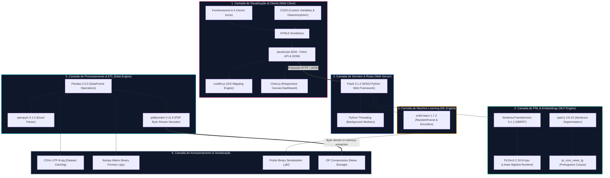

# Arquitetura Tecnológica e Stack de Software — Observatório IA

Este documento detalha a arquitetura tecnológica, as escolhas de infraestrutura de software, os formatos de serialização de dados e os protocolos de comunicação implementados no ecossistema do **Observatório IA**.

---

## 💻 Diagrama de Camadas Tecnológicas

O ecossistema tecnológica do Observatório IA está estruturado em 6 camadas interoperáveis, utilizando exclusivamente tecnologias maduras, estáveis e de alto desempenho:



---

## 📊 Matriz de Tecnologias Usadas

| Componente | Tecnologia | Versão | Papel no Projeto | Justificativa de Engenharia |
|---|---|---|---|---|
| **Web Server** | `Flask` | 3.1.2 | Servidor web WSGI, roteamento HTTP e REST API. | Leveza absoluta, baixa sobrecarga, fácil customização de respostas e integração nativa com scripts Python de ML. |
| **GIS Engine** | `Leaflet.js` | 1.9.4 | Renderização interativa de mapas georreferenciados. | Open-source, extremamente leve no cliente, livre de chaves de API pagas (como Google Maps) e suporte total a tilelayers customizados em modo escuro. |
| **Charts Engine** | `Chart.js` | 4.x | Renderização em tempo real de gráficos estatísticos. | Desempenho excelente através de renderização em HTML5 Canvas, interatividade ao passar o mouse (tooltips) e design responsivo. |
| **NLP Engine** | `spaCy` | 3.8.14 | Segmentação de sentenças em português. | Modelo de aprendizado de máquina otimizado para português (`pt_core_news_lg`), garantindo quebra de texto em sentenças coerentes e corretas. |
| **ML Engine** | `scikit-learn` | 1.7.2 | Pré-processadores categóricos e modelos de RandomForest. | Excelente implementação de algoritmos de Ensemble em CPU, multithreading nativo (`n_jobs=-1`), robustez a sobreajuste (overfitting). |
| **Deep Learning** | `SentenceTransformers` | 5.1.1 | Codificação de texto em representações densas (Embeddings). | Facilidade de carregamento de redes XLM-RoBERTa e Distiluse pré-treinados, com excelentes resultados para representações semânticas em português. |
| **Tensor Math** | `PyTorch (CPU)` | 2.10.0 | Runtime de inferência e álgebra linear profunda. | Backend matemático eficiente para execução de inferência em CPU sem a necessidade obrigatória de placas gráficas Nvidia (CUDA). |
| **PDF Processing** | `pdfplumber` | 0.11.9 | Decodificação de streams de bytes de arquivos PDF. | Alta precisão na extração de texto em colunas estruturadas e layouts de imprensa, muito superior a bibliotecas puras de marcação como PyPDF2. |
| **Data Engine** | `Pandas` | 2.3.0 | Manipulação estruturada de matrizes de dados (DataFrames). | Altíssima velocidade de processamento vetorial (baseada em C/C++), facilidade de filtragem, agregação e acoplamento com exportadores. |

---

## 💾 Especificação de Serialização e Schemas

Para evitar a necessidade de configurar bancos de dados relacionais e vetoriais pesados (como PostgreSQL e Qdrant) na máquina local durante a fase doutoral, implementamos uma arquitetura de **Banco de Dados Emulado e Serializado** altamente eficiente em arquivos:

### 1. Schema do Dataset Processado (`dataset_with_similarities.csv`)
Tabela estruturada armazenando os chunks de texto, os metadados agregados e os scores de similaridades calculados contra as descrições.
- **Formato:** CSV UTF-8 com BOM (`utf-8-sig`) para preservação integral de acentuações e cedilhas em português no Excel.
- **Estrutura de Colunas:**
  - `id_chunk`: String (`{código_notícia}_c{index_chunk}`).
  - `codigo_noticia`: String (Código único de casamento).
  - `titulo_noticia`: String.
  - `chunk_texto`: String (Bloco textual de $\approx 500$ caracteres).
  - `estado` / `municipio` / `nome_movimento` / `pauta_acao`: Strings estruturadas.
  - `sim_score_{nome_acao}`: Float (Valores em $[-1, 1]$, representando a similaridade cosseno para cada uma das 47 ações derivadas).

### 2. Schema dos Chunks Densos (`chunk_embeddings.npy`)
Matriz binária contendo as coordenadas vetoriais brutas de cada chunk.
- **Formato:** Numpy Binary Format (`.npy`).
- **Dimensões:** $M \times 512$, onde $M$ é o número total de chunks semânticos gerados no dataset e $512$ representa as dimensões da embedding do modelo Distiluse.
- **Tipo de Dados:** `float32`.

### 3. Modelos Persistidos (`classifier_derivada.pkl` e `classifier_matriz.pkl`)
- **Formato:** Binary Pickle Serialization (`.pkl`).
- **Conteúdo:** Objetos RandomForestClassifier da scikit-learn serializados contendo toda a estrutura de nós de decisão (decision trees), limiares de divisão (splits) e distribuições de voto ponderado prontas para inferência imediata sem custos de re-treinamento.

---

## 📡 Protocolos de Comunicação da API REST

A comunicação entre a interface web reativa (cliente) e o servidor de inteligência Flask é feita através de chamadas HTTP REST estruturadas em JSON:

### 1. Serviço de Inferência Semântica (`POST /api/classify`)
- **Payload de Entrada (JSON):**
  ```json
  {
    "text": "Ocupação de fazenda improdutiva pelo MST em Eldorado dos Carajás...",
    "estado": "Pará",
    "pauta": "luta pela terra;",
    "movimento": "Movimento dos Trabalhadores Sem Terra (MST)"
  }
  ```
- **Payload de Saída (JSON):**
  ```json
  {
    "classificacao_geral": {
      "acao_derivada": "OCUPAÇÃO DE TERRA",
      "confianca_derivada": 0.875,
      "acao_matriz": "OCUPACAO",
      "confianca_matriz": 0.940
    },
    "chunks": [
      {
        "chunk_id": "web_c0",
        "texto": "Ocupação de fazenda improdutiva pelo MST...",
        "acao_derivada": "OCUPAÇÃO DE TERRA",
        "confianca_derivada": 0.875,
        "acao_matriz": "OCUPACAO",
        "confianca_matriz": 0.940
      }
    ]
  }
  ```

### 2. Serviço de Dados Georreferenciados (`GET /api/map-data`)
- **Payload de Saída (JSON):**
  ```json
  [
    {
      "id": "220824AGR_D_c0",
      "lat": -3.2109,
      "lng": -60.1017,
      "estado": "Amazonas",
      "municipio": "Manaus",
      "movimento": "Comissão Pastoral da Terra (CPT)",
      "acao_derivada": "ENTREVISTA CONCEDIDA",
      "pauta": "violência no campo"
    }
  ]
  ```
