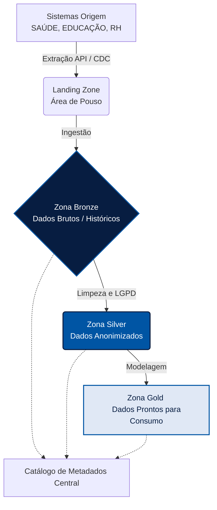

# Camada 1: Data Lake

A Camada 1 (Data Lake) é o repositório central unificado que armazena todos os dados brutos ou fracamente estruturados provenientes dos diversos sistemas estruturantes do governo. Esta fundação garante que não haja perda de histórico e que os dados estejam disponíveis para processamento avançado.

## Governança de Dados e Catálogo

Em alinhamento com a Política de Dados Abertos e transparência ativa (referência dados.mt.gov.br) e guiados pelo framework **DAMA-DMBOK**, implementamos um catálogo de dados corporativo rigoroso.

*   **Ingestão de Dados:** Utilizamos pipelines automatizados que suportam processamento em batch e streaming (tempo real) para garantir a atualização contínua.
*   **Gestão de Metadados:** Cada tabela ou arquivo no Data Lake possui metadados associados informando sua origem, periodicidade de atualização, sensibilidade (LGPD) e dono funcional, evitando a criação de "pântanos de dados" (data swamps).
*   **Qualidade de Dados (Data Quality):** Processos de monitoramento para garantir completude, conformidade e exatidão desde a entrada da informação.

## Arquitetura de Zonas de Processamento (Multi-layer)

Adotamos a arquitetura de camadas lógicas, que é o padrão-ouro em implementações governamentais de grande escala (ex: Data Lake MG), permitindo separar os dados pelo seu nível de tratamento:

*   **Zona Bronze (Raw):** Recebe e armazena os dados em seu formato original, sem alterações. Atua como um registro imutável, fundamental para rastreabilidade e auditorias governamentais.
*   **Zona Silver (Processed):** Onde ocorre a higienização. Os dados são tipados, padronizados e, crucialmente, **anonimizados ou mascarados** para estrita conformidade com a LGPD.
*   **Zona Gold (Curated):** Focada na entrega de valor (documentada com mais detalhes na Camada 2). Abriga os modelos dimensionais prontos para alimentar portais de transparência e painéis de BI executivos.

## Segurança e Acesso
O acesso a esta camada é estritamente controlado via políticas de IAM (Identity and Access Management). O princípio adotado é o de *Least Privilege* (Menor Privilégio), onde analistas possuem acesso apenas às visões da Zona Silver em diante, salvo autorização explícita registrada em auditoria para acesso à Zona Bronze.
