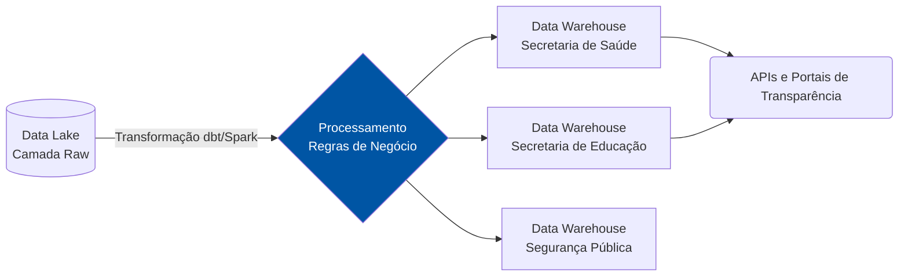

# Camada 2: Secretarias

A Camada 2 abriga os **Dados Curados (Camada Silver/Gold)**, que passaram por processos de padronização, higienização e modelagem. Os dados aqui estão organizados por domínios de negócio, refletindo as diferentes Secretarias de Estado.

## Organização por Domínio

Seguindo a arquitetura de *Data Mesh*, os dados curados são tratados como **Produtos de Dados**. Cada Secretaria (Domínio) é responsável pela qualidade e pelas regras de negócio aplicadas aos seus conjuntos de dados.

### Secretarias em Destaque

1.  **Saúde (SES)**
    *   *Dados Disponíveis:* Ocupação de leitos hospitalares, histórico de imunizações, índices epidemiológicos.
    *   *Público-alvo:* Gestores do SUS e portais de transparência.

2.  **Educação (SEDUC)**
    *   *Dados Disponíveis:* Censo escolar estadual, frequência de alunos, infraestrutura de unidades de ensino.
    *   *Público-alvo:* Analistas de políticas públicas educacionais.

3.  **Segurança Pública (SESP)**
    *   *Dados Disponíveis:* Boletins de ocorrência unificados, mapas de mancha criminal, efetivo de segurança.
    *   *Restrição:* Alto nível de anonimização e conformidade estrita com a LGPD.

## Fluxo de Transformação de Negócio

## Publicação em Dados Abertos
Os dados curados que não possuem restrição de sigilo ou privacidade são automaticamente exportados em formatos abertos (CSV, JSON, Parquet) e catalogados no formato DCAT para consumo via portal de Dados Abertos (e.g. dados.mt.gov.br).
