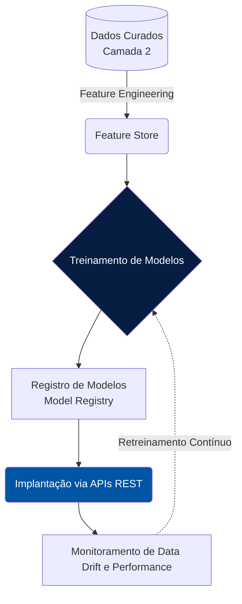

# Camada 3: MT 360

O MT 360 é o ápice da maturidade analítica da nossa plataforma. Ele congrega modelos de *Machine Learning* e algoritmos de Inteligência Artificial desenvolvidos para otimizar a máquina pública e melhorar a oferta de serviços ao cidadão.

## Nossos Modelos de Inteligência Artificial

A plataforma centraliza o ciclo de vida de Machine Learning (MLOps), garantindo que os modelos preditivos sejam justos, transparentes e passíveis de auditoria.

### Iniciativas Atuais

*   **Prevenção de Evasão Escolar (Educação):** 
    Modelo preditivo que analisa o histórico de frequência e notas para identificar alunos em risco de evasão, permitindo ação preventiva da coordenação escolar.
*   **Otimização de Escalas Médicas (Saúde):**
    Algoritmo de predição de demanda em unidades de pronto atendimento baseado em séries temporais e dados sazonais.
*   **Detecção de Fraudes Fiscais (Fazenda):**
    Análise de anomalias em notas fiscais eletrônicas e cruzamento de dados de inteligência fiscal para combater a sonegação.

## Fluxo de Operação de IA (MLOps)

## Governança e Marcos de Referência

Para garantir o desenvolvimento e uso ético da inteligência artificial no setor público, nosso Observatório atua em alinhamento com as principais diretrizes nacionais e internacionais de IA Responsável:

*   **Gestão de Riscos (NIST AI RMF):** Utilizamos o *Risk Management Framework* do NIST como padrão técnico para mapear, mensurar e gerenciar os riscos de sistemas algorítmicos. Modelos que afetam benefícios de cidadãos são classificados como de alto risco e recebem avaliações rigorosas antes da implantação.
*   **Princípios da OCDE:** Adotamos ativamente as recomendações do *OECD.AI Policy Observatory*, pautando nossos projetos em valores como Transparência, Explicabilidade, Justiça, Segurança e Robustez.
*   **Integração com o OBIA:** Acompanhamos os indicadores e boas práticas promovidas pelo **Observatório Brasileiro de Inteligência Artificial (OBIA)** e pelo *Plano Brasileiro de IA (PBIA)*, visando cooperar na rede nacional de desenvolvimento seguro da tecnologia.

## Ética e Transparência
Todos os algoritmos que afetam o cidadão diretamente possuem documentação de impacto (**Model Cards**) publicadas de forma transparente no portal. Essa prática garante não apenas a explicabilidade técnica dos algoritmos, mas permite que a sociedade compreenda quais variáveis influenciam as decisões automatizadas do Estado e monitore potenciais vieses sociais.
