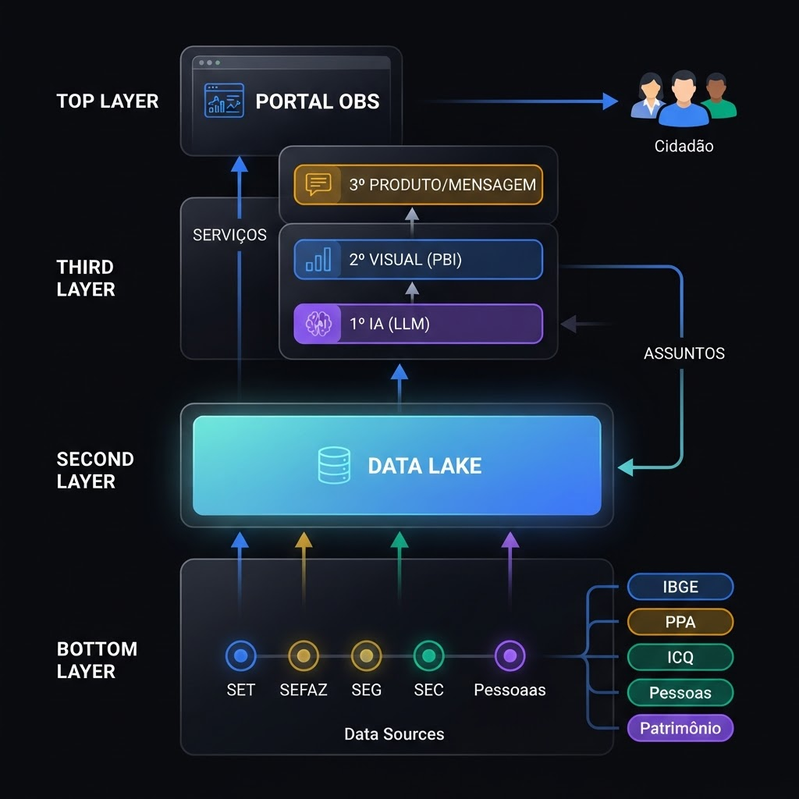

---
hide:
  - navigation
  - toc
---

  

    <svg width="18" height="18" viewBox="0 0 24 24" fill="none" stroke="#10b981" stroke-width="2" style="margin-right: 8px;"><path d="M12 2l3 6 6 3-6 3-3 6-3-6-6-3 6-3z"></path></svg> Transparência e Gestão Pública de Excelência
  

  <h1 class="hero-title">INDICADORES ESTRATÉGICOS PARA UM ESTADO BRILHANTE</h1>
  

    Monitoramento em tempo real de Saúde, Educação, Segurança e Infraestrutura.
    Decisões baseadas em dados com transparência e excelência.
  

  
  

    <a href="paineis-indicadores/" class="btn btn-primary">Acessar Painel &rarr;</a>
    <a href="http://167.114.5.193:8000/assistente-ia/" class="btn btn-secondary">
      <svg width="18" height="18" viewBox="0 0 24 24" fill="none" stroke="#10b981" stroke-width="2" style="margin-right: 8px;"><path d="M12 2l3 6 6 3-6 3-3 6-3-6-6-3 6-3z"></path></svg>
      Assistente IA
    </a>
  

  

    

      <h4>26+</h4>
      
Pontos Mapeados

    

    

      <h4>4</h4>
      
Áreas Monitoradas

    

    

      <h4>8</h4>
      
Meses de Dados

    

  

  ÁREAS DE GESTÃO
  <h2 class="section-title">Nossos Indicadores</h2>
  
Quatro pilares estratégicos monitorados com dados em tempo real para garantir a excelência na gestão pública.

  

    

      

        <svg xmlns="http://www.w3.org/2000/svg" width="20" height="20" viewBox="0 0 24 24" fill="none" stroke="currentColor" stroke-width="2" stroke-linecap="round" stroke-linejoin="round"><path d="M20.84 4.61a5.5 5.5 0 0 0-7.78 0L12 5.67l-1.06-1.06a5.5 5.5 0 0 0-7.78 7.78l1.06 1.06L12 21.23l7.78-7.78 1.06-1.06a5.5 5.5 0 0 0 0-7.78z"></path></svg>
      

      <h3>Saúde</h3>
      
Monitoramento de leitos, atendimentos, cobertura vacinal e indicadores hospitalares em tempo real.

      

        4.300 leitos · 95% vacinação
        ↗
      

    

    

      

        <svg xmlns="http://www.w3.org/2000/svg" width="20" height="20" viewBox="0 0 24 24" fill="none" stroke="currentColor" stroke-width="2" stroke-linecap="round" stroke-linejoin="round"><path d="M4 19.5A2.5 2.5 0 0 1 6.5 17H20"></path><path d="M6.5 2H20v20H6.5A2.5 2.5 0 0 1 4 19.5v-15A2.5 2.5 0 0 1 6.5 2z"></path></svg>
      

      <h3>Educação</h3>
      
Acompanhamento de matrículas, taxas de aprovação, evasão escolar e IDEB estadual.

      

        340K matrículas · IDEB 4.2
        ↗
      

    

    

      

        <svg xmlns="http://www.w3.org/2000/svg" width="20" height="20" viewBox="0 0 24 24" fill="none" stroke="currentColor" stroke-width="2" stroke-linecap="round" stroke-linejoin="round"><path d="M12 22s8-4 8-10V5l-8-3-8 3v7c0 6 8 10 8 10z"></path></svg>
      

      <h3>Segurança</h3>
      
Controle de ocorrências, taxa de resolução, efetivo policial e patrulhamento por região.

      

        90% resolução · -25% ocorrências
        ↗
      

    

    

      

        <svg xmlns="http://www.w3.org/2000/svg" width="20" height="20" viewBox="0 0 24 24" fill="none" stroke="currentColor" stroke-width="2" stroke-linecap="round" stroke-linejoin="round"><rect x="4" y="2" width="16" height="20" rx="2" ry="2"></rect><path d="M9 22v-4h6v4"></path><path d="M8 6h.01"></path><path d="M16 6h.01"></path><path d="M12 6h.01"></path><path d="M12 10h.01"></path><path d="M12 14h.01"></path><path d="M16 10h.01"></path><path d="M16 14h.01"></path><path d="M8 10h.01"></path><path d="M8 14h.01"></path></svg>
      

      <h3>Infraestrutura</h3>
      
Gestão de obras, investimentos, municípios atendidos e progresso de projetos estratégicos.

      

        72 obras · R$400M investidos
        ↗
      

    

  

  Sobre o Observatório
  <h2 class="section-title">Um Data Lake para todo o Estado</h2>
  

    O MT 360º atua como um Data Lake central, unificando os dados de <strong>39 secretarias</strong> do Estado em uma única plataforma inteligente. Rompemos com a fragmentação de informações...
  

  

    

      <svg width="48" height="48" viewBox="0 0 24 24" fill="none" stroke="currentColor" stroke-width="1.5" stroke-linecap="round" stroke-linejoin="round"><ellipse cx="12" cy="5" rx="9" ry="3"></ellipse><path d="M21 12c0 1.66-4 3-9 3s-9-1.34-9-3"></path><path d="M3 5v14c0 1.66 4 3 9 3s9-1.34 9-3V5"></path></svg>
    

    <h3>MT 360º</h3>
    
Data Lake Central - 39 Secretarias Integradas

    
    

      
SEPLAG

      
SES

      
SEDUC

      
SESP

      
SEFAZ

      
SINFRA

      
SEMA

      
SETASC

    

    
+ 31 secretarias

  

  

    

      

        <svg width="24" height="24" viewBox="0 0 24 24" fill="none" stroke="currentColor" stroke-width="2" stroke-linecap="round" stroke-linejoin="round"><ellipse cx="12" cy="5" rx="9" ry="3"></ellipse><path d="M21 12c0 1.66-4 3-9 3s-9-1.34-9-3"></path><path d="M3 5v14c0 1.66 4 3 9 3s9-1.34 9-3V5"></path></svg>
      

      <h3 style="font-size: 1rem !important;">Data Lake Unificado</h3>
      
Centralizamos dados de 39 secretarias em um único repositório, eliminando ilhas de informação.

    

    

      

        <svg width="24" height="24" viewBox="0 0 24 24" fill="none" stroke="currentColor" stroke-width="2" stroke-linecap="round" stroke-linejoin="round"><line x1="6" y1="3" x2="6" y2="15"></line><circle cx="18" cy="6" r="3"></circle><circle cx="6" cy="18" r="3"></circle><path d="M18 9a9 9 0 0 1-9 9"></path></svg>
      

      <h3 style="font-size: 1rem !important;">Integração de Fontes</h3>
      
Conectamos sistemas legados, bancos de dados e APIs de todos os órgãos estaduais em tempo real.

    

    

      

        <svg width="24" height="24" viewBox="0 0 24 24" fill="none" stroke="currentColor" stroke-width="2" stroke-linecap="round" stroke-linejoin="round"><rect x="4" y="4" width="16" height="16" rx="2" ry="2"></rect><rect x="9" y="9" width="6" height="6"></rect><line x1="9" y1="1" x2="9" y2="4"></line><line x1="15" y1="1" x2="15" y2="4"></line><line x1="9" y1="20" x2="9" y2="23"></line><line x1="15" y1="20" x2="15" y2="23"></line><line x1="20" y1="9" x2="23" y2="9"></line><line x1="20" y1="14" x2="23" y2="14"></line><line x1="1" y1="9" x2="4" y2="9"></line><line x1="1" y1="14" x2="4" y2="14"></line></svg>
      

      <h3 style="font-size: 1rem !important;">Inteligência Artificial</h3>
      
Algoritmos de IA processam e analisam milhões de registros para gerar insights estratégicos.

    

    

      

        <svg width="24" height="24" viewBox="0 0 24 24" fill="none" stroke="currentColor" stroke-width="2" stroke-linecap="round" stroke-linejoin="round"><polygon points="12 2 2 7 12 12 22 7 12 2"></polygon><polyline points="2 12 12 17 22 12"></polyline><polyline points="2 17 12 22 22 17"></polyline></svg>
      

      <h3 style="font-size: 1rem !important;">Visão Integrada</h3>
      
Dashboards interativos que cruzam dados de múltiplas secretarias para decisões assertivas.

    

  

  

    <a href="camada1-datalake/" class="btn btn-primary" style="background: #55b44d;">Explorar os Dados →</a>
  

  <h2 class="section-title">Metodologia do Observatório de IA</h2>
  
Do dado bruto à decisão estratégica: um fluxo estruturado em quatro etapas que garante confiabilidade e agilidade.

  

    
  

    

        

            <svg width="24" height="24" viewBox="0 0 24 24" fill="none" stroke="currentColor" stroke-width="2"><circle cx="11" cy="11" r="8"></circle><line x1="21" y1="21" x2="16.65" y2="16.65"></line></svg>
        

        <h4>1. Coleta de Dados</h4>
        
Captura automatizada de dados das 39 secretarias via APIs, ETL e conectores de sistemas legados, garantindo origem rastreável.

    

    

        <svg width="24" height="24" viewBox="0 0 24 24" fill="none" stroke="currentColor" stroke-width="2"><polyline points="9 18 15 12 9 6"></polyline></svg>
    

    

        

            <svg width="24" height="24" viewBox="0 0 24 24" fill="none" stroke="currentColor" stroke-width="2"><polygon points="22 3 2 3 10 12.46 10 19 14 21 14 12.46 22 3"></polygon></svg>
        

        <h4>2. Tratamento & Padronização</h4>
        
Limpeza, normalização e padronização dos dados em um esquema único, eliminando duplicidades e inconsistências.

    

    

        <svg width="24" height="24" viewBox="0 0 24 24" fill="none" stroke="currentColor" stroke-width="2"><polyline points="9 18 15 12 9 6"></polyline></svg>
    

    

        

            <svg width="24" height="24" viewBox="0 0 24 24" fill="none" stroke="currentColor" stroke-width="2"><path d="M9.5 2A2.5 2.5 0 0 1 12 4.5v15a2.5 2.5 0 0 1-4.96.44 2.5 2.5 0 0 1-2.96-3.08 2.5 2.5 0 0 1-.34-4.8 2.5 2.5 0 0 1 2.37-3.9 2.5 2.5 0 0 1 3.39-2.12V4.5A2.5 2.5 0 0 1 9.5 2z"></path><path d="M14.5 2A2.5 2.5 0 0 0 12 4.5v15a2.5 2.5 0 0 0 4.96.44 2.5 2.5 0 0 0 2.96-3.08 2.5 2.5 0 0 0 .34-4.8 2.5 2.5 0 0 0-2.37-3.9 2.5 2.5 0 0 0-3.39-2.12V4.5A2.5 2.5 0 0 0 14.5 2z"></path></svg>
        

        <h4>3. Análise por IA</h4>
        
Modelos de inteligência artificial identificam padrões, tendências e correlações entre indicadores de diferentes áreas.

    

    

        <svg width="24" height="24" viewBox="0 0 24 24" fill="none" stroke="currentColor" stroke-width="2"><polyline points="9 18 15 12 9 6"></polyline></svg>
    

    

        

            <svg width="24" height="24" viewBox="0 0 24 24" fill="none" stroke="currentColor" stroke-width="2"><line x1="18" y1="20" x2="18" y2="10"></line><line x1="12" y1="20" x2="12" y2="4"></line><line x1="6" y1="20" x2="6" y2="14"></line></svg>
        

        <h4>4. Visualização Estratégica</h4>
        
Dashboards interativos traduzem os resultados em insights visuais claros para apoiar a tomada de decisão dos gestores.

    

    

        

            <svg width="16" height="16" viewBox="0 0 24 24" fill="none" stroke="currentColor" stroke-width="2"><polyline points="23 4 23 10 17 10"></polyline><polyline points="1 20 1 14 7 14"></polyline><path d="M3.51 9a9 9 0 0 1 14.85-3.36L23 10M1 14l4.64 4.36A9 9 0 0 0 20.49 15"></path></svg>
        

        
<strong>Atualização Contínua</strong> Dados refresh em tempo real ou diário

    

    

        

            <svg width="16" height="16" viewBox="0 0 24 24" fill="none" stroke="currentColor" stroke-width="2"><path d="M12 22s8-4 8-10V5l-8-3-8 3v7c0 6 8 10 8 10z"></path></svg>
        

        
<strong>Segurança & LGPD</strong> Conformidade garantida

    

    <a href="dashboard/" class="btn btn-primary" style="padding: 0.8rem 2.5rem; font-size: 1.05rem;">Ver os Indicadores &rarr;</a>

    <h2 class="section-title">O Impacto das Ações Governamentais</h2>
    
Evolução dos indicadores estratégicos ao longo de 2024

    

        

            

                
📈

                <h3 style="font-size: 1.8rem !important; margin: 0 !important;">+12.5%</h3>
                
Crescimento Anual

            

            

                
⏱️

                <h3 style="font-size: 1.8rem !important; margin: 0 !important;">88%</h3>
                
Metas Atingidas

            

        

        

            

                

                    <h4 style="margin: 0; font-weight: 700; color: #0f172a;">Tendência de Metas Atingidas</h4>
                    Jan &mdash; Ago 2024
                

                +26%
            

            

                

            

            

                FevMarAbrMaiJunJulAgo
            

        

        

            

                
🛡️

                <h3 style="font-size: 1.8rem !important; margin: 0 !important;">Baixo</h3>
                
Risco Gerenciado

            

            

                
👥

                <h3 style="font-size: 1.8rem !important; margin: 0 !important;">184</h3>
                
Municípios Atendidos

            

        

    

    <h2 class="section-title">Depoimentos</h2>
    
O que os gestores públicos dizem sobre o impacto do painel de indicadores

    

        

            
&ldquo;

            
"O painel transformou nossa forma de acompanhar indicadores. A transparência dos dados fortaleceu a confiança da população."

            

                
                

                    <strong style="color: #0f172a; font-size: 0.9rem;">Dr. Carlos Mendes</strong> 
                    Secretário de Saúde
                

            

        

        

            
&ldquo;

            
"Com os dados em tempo real conseguimos identificar gargalos na educação e agir rapidamente. Resultado: evasão caiu 33%."

            

                
                

                    <strong style="color: #0f172a; font-size: 0.9rem;">Profa. Ana Ribeiro</strong> 
                    Secretária de Educação
                

            

        

        

            
&ldquo;

            
"A redução de 23% nas ocorrências se deve diretamente ao monitoramento estratégico. Decisões baseadas em dados salvam vidas."

            

                
                

                    <strong style="color: #0f172a; font-size: 0.9rem;">Coronel Roberto Lima</strong> 
                    Comando Geral PM
                

            

        

        

            
&ldquo;

            
"O controle de obras e investimentos trouxe eficiência sem precedentes. 30 obras concluídas em um mês é recorde histórico."

            

                
                

                    <strong style="color: #0f172a; font-size: 0.9rem;">Eng. Patrícia Souza</strong> 
                    Secretária de Infraestrutura
                

            

        

    

    

        

            <h2 class="section-title" style="text-align: left;">Solicite uma Análise</h2>
            
Entre em contato para solicitar análises detalhadas, relatórios personalizados ou tirar dúvidas sobre os indicadores.

            
            <ul style="list-style: none; padding: 0; line-height: 2.5; font-size: 0.95rem; font-weight: 500;">
                <li><a href="#" style="color: #032b5e; text-decoration: none;">Home</a></li>
                <li><a href="#" style="color: #032b5e; text-decoration: none;">Saúde</a></li>
                <li><a href="#" style="color: #032b5e; text-decoration: none;">Educação</a></li>
                <li><a href="#" style="color: #032b5e; text-decoration: none;">Segurança</a></li>
                <li><a href="#" style="color: #032b5e; text-decoration: none;">Infraestrutura</a></li>
            </ul>
        

        

            

                

                    <label style="display: block; font-size: 0.85rem; font-weight: 600; margin-bottom: 0.5rem; color: #475569;">Nome</label>
                    <input type="text" placeholder="Seu nome completo" style="width: 100%; padding: 12px 16px; border: 1px solid #cbd5e1; border-radius: 8px; font-family: inherit; outline: none; box-sizing: border-box;" />
                

                

                    <label style="display: block; font-size: 0.85rem; font-weight: 600; margin-bottom: 0.5rem; color: #475569;">E-mail</label>
                    <input type="email" placeholder="seu@email.gov.br" style="width: 100%; padding: 12px 16px; border: 1px solid #cbd5e1; border-radius: 8px; font-family: inherit; outline: none; box-sizing: border-box;" />
                

            

            

                <label style="display: block; font-size: 0.85rem; font-weight: 600; margin-bottom: 0.5rem; color: #475569;">Mensagem</label>
                <textarea rows="4" placeholder="Descreva sua solicitação de análise..." style="width: 100%; padding: 12px 16px; border: 1px solid #cbd5e1; border-radius: 8px; font-family: inherit; outline: none; resize: vertical; box-sizing: border-box;"></textarea>
            

            <button class="btn btn-primary" style="width: 100%; justify-content: center; font-size: 1rem;">ENVIAR MENSAGEM</button>
        

    

<footer style="background: white; border-top: 1px solid #e2e8f0; padding: 2rem 1rem;">
    

        

            
📊

            &copy; 2024 Observatório de IA MT - Painel de Indicadores Estratégicos
        

        

            <a href="#" style="color: #475569; text-decoration: none;">Termos</a>
            <a href="#" style="color: #475569; text-decoration: none;">Privacidade</a>
            <a href="#" style="color: #475569; text-decoration: none;">Contato</a>
        

    

</footer>

