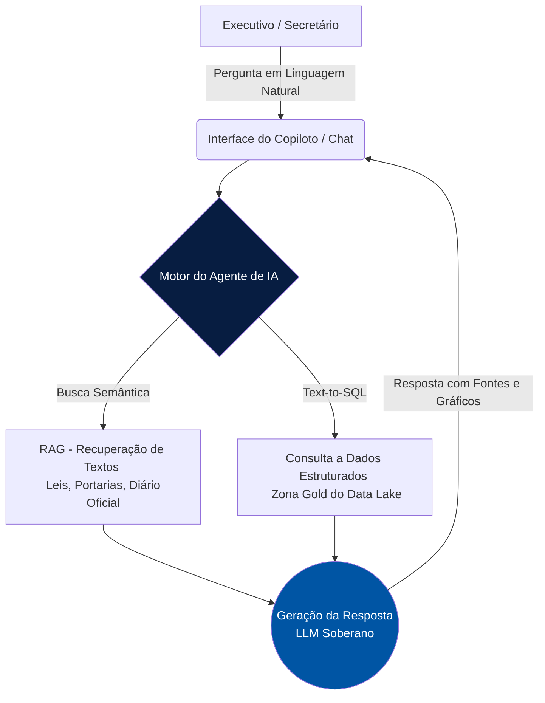

# Copiloto Executivo: Agente de IA para a Gestão

Em resposta à necessidade de dar agilidade à tomada de decisão na Secretaria de Educação (SEDUC), o Observatório de IA documenta e prototipa a arquitetura do **Agente Especializado para a Área Executiva** (Copiloto Educacional).

Este projeto visa substituir a busca manual em dezenas de relatórios por uma interface conversacional de linguagem natural, permitindo que Secretários, Adjuntos e Diretores interajam diretamente com o Data Lake.

---

## 🚀 Experimente o Protótipo do Agente

Para demonstrar o poder da interface conversacional, eu construí este **Simulador Interativo** do Copiloto. 

*(Digite uma pergunta sobre a rede estadual de ensino ou clique em "Enviar" para testar uma simulação automática)*

  

    
<i class="fa-solid fa-robot"></i> IA

    

      
Copiloto Executivo (GovData)

      
● Online - Conectado à Zona Gold

    

  

  
  

    

      Olá, Secretário(a). Sou o Copiloto de IA do Governo. Tenho acesso aos dados atualizados de Educação, Saúde e Segurança. Como posso ajudar na sua tomada de decisão hoje?
    

  

  
O Copiloto está analisando o Data Lake...

  
  

    <input type="text" id="chatInput" class="chat-input" placeholder="Ex: Qual a escola com maior queda de IDEB na região norte?" autocomplete="off" onkeypress="handleKeyPress(event)">
    <button class="btn-send" onclick="sendMessage()"><i class="fa-solid fa-paper-plane"></i> Enviar</button>
  

<link href="https://cdnjs.cloudflare.com/ajax/libs/font-awesome/6.0.0/css/all.min.css" rel="stylesheet">

---

## Arquitetura da Solução (Agente RAG + Text-to-SQL)

Para garantir que a IA não invente dados (alucinação) e respeite a LGPD, utilizamos uma arquitetura híbrida que conecta Grandes Modelos de Linguagem (LLMs) diretamente às bases seguras do Estado.

## Componentes Técnicos

1. **LLM Base:** Utilização de um modelo de linguagem avançado (podendo ser hospedado localmente no Data Center do Estado para dados sensíveis, ou via API segura com zero-retention policy).
2. **Text-to-SQL:** A habilidade do agente de traduzir a pergunta do Secretário ("Qual o gasto total?") para uma query SQL (`SELECT SUM(gasto) FROM...`) que roda diretamente no Data Warehouse da Educação.
3. **RAG (Retrieval-Augmented Generation):** Banco de dados vetorial contendo o Plano Estadual de Educação, Diretrizes Curriculares e Atas de Reuniões, permitindo que a IA cite as leis corretas.

## Governança e Transparência (Model Card)

A implementação deste agente na área executiva segue diretrizes estritas do nosso modelo de gestão de riscos (NIST AI RMF):

* **Controle de Acesso (IAM):** O agente herda as permissões do usuário logado. Um diretor regional só consegue perguntar e receber respostas sobre a sua própria região.
* **Auditabilidade:** Todas as interações (prompts) feitas pelo alto escalão ficam registradas em um log de auditoria, garantindo a rastreabilidade das decisões tomadas com apoio da IA.
* **Verificação de Fontes (Grounding):** A interface do agente é obrigada a exibir o link direto para a fonte que gerou a resposta (ex: tabela do banco de dados), permitindo checagem técnica rigorosa.
